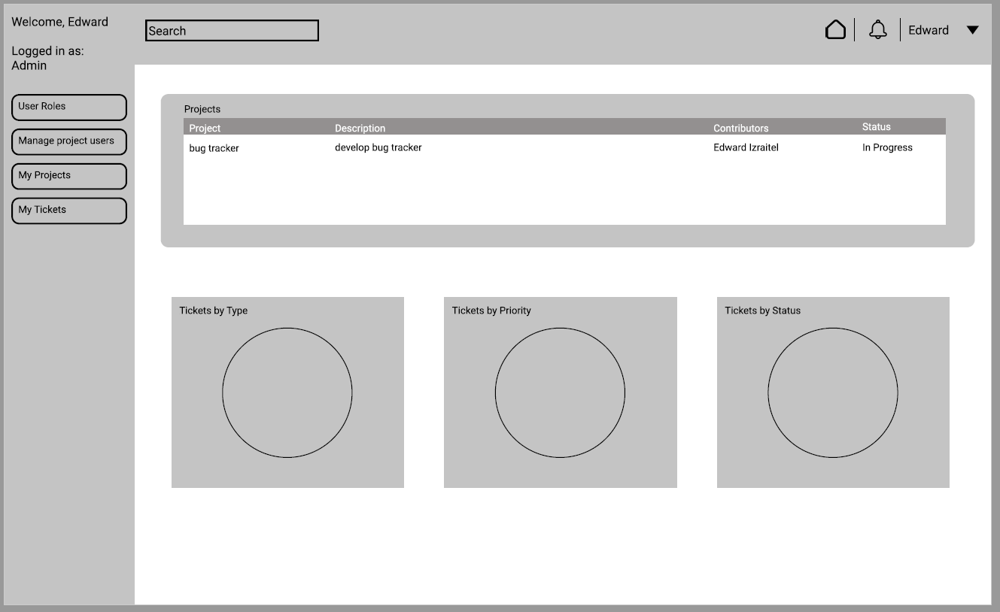
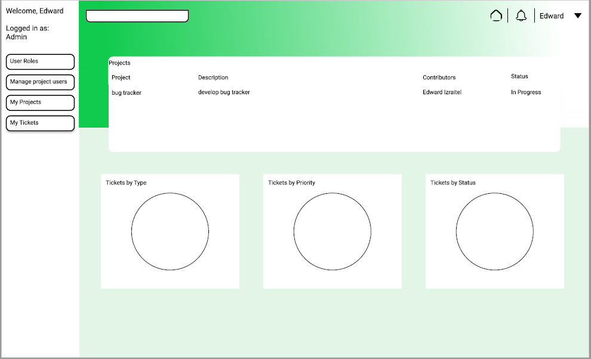

# IssueTracker

The goal of this issue tracker is to use the following technologies:
- Figma (design)
- React
- Python
- AWS for deployment
- Docker

More technologies will be added as the project progresses

## Follow my development journey as I develop an issue tracker from scratch

- Homepage design process:

